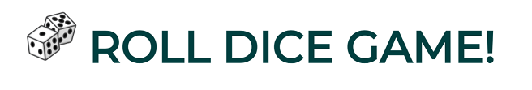
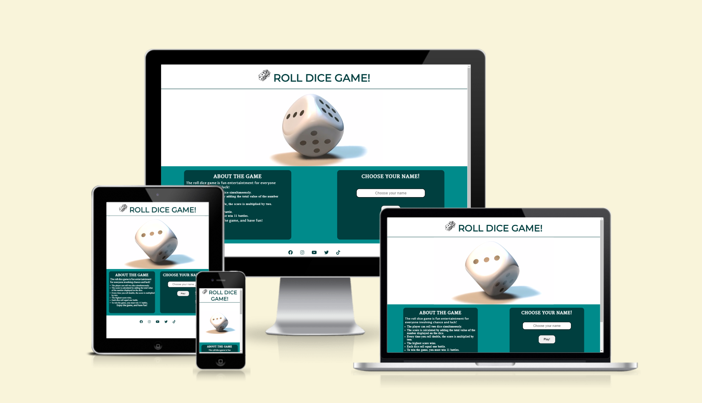
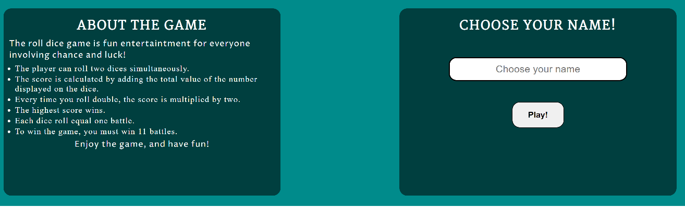
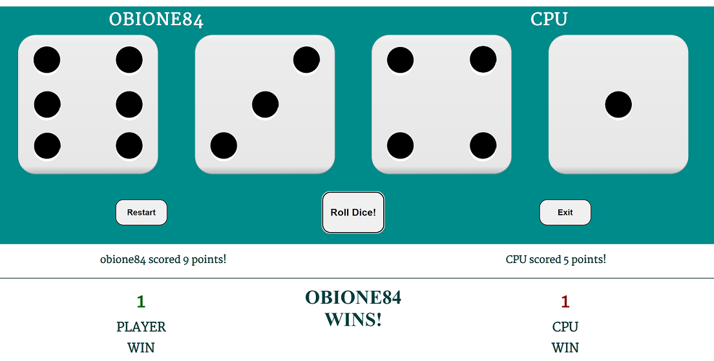
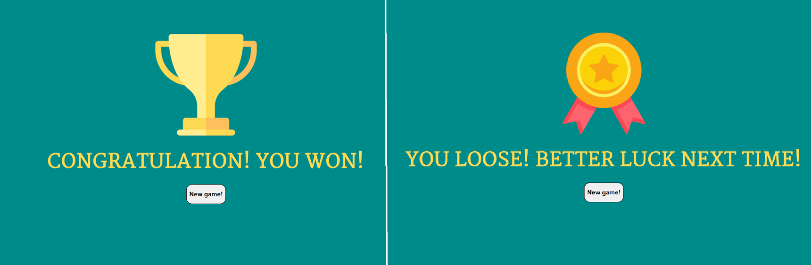
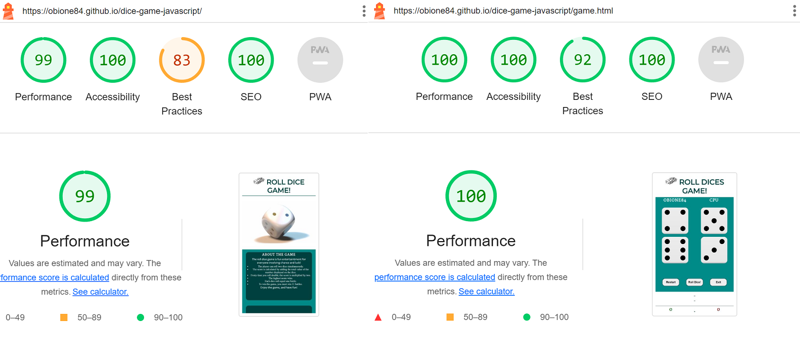

# Roll Dice Game #

The Roll Dice Game is a landing page for people looking for online entertainment. The website provides a dice game for the user based on luck and chance. The main page includes information about the game rules, user name login and social media links. After giving the user name on the landing page, the player will be directed to the game area where it will contest the computer against a challenging battle of roll dice game. To win the game, the user must win eleven matches corresponding to eleven winning dice rolls. The user will roll two dice simultaneously. The higher number wins. When the user rolls double, the sum will multiply by two.

Click [HERE](https://obione84.github.io/dice-game-javascript/) to visit a live page or follow the link below:  
<https://obione84.github.io/dice-game-javascript/>

---

## Features ##

### Current Features ###

### *1. The Landing Page Image* ###

- This section contains a video of rolling dice, allowing users to understand the website's purpose and target audience clearly. The focus is on people looking for online entertainment and wishing to join a challenging game of rolling dice.

  

### *2. The About Game Section* ###

- The about us section contains game rules and a user name login area.
- This section outlines general rules, explaining the score calculation and winning requirements.
- The about game section includes the player name login area, where a user must provide the name to start the game.
- The user cannot access the game without providing the name.
  
 

### *3. The Footer* ###

- The footer section includes links to social media sites for game developer. The links will open in a new tab, encouraging the user to connect with the game developer via social media and checking for updates to the game or new releases.

 

### *4. The Game Page* ###

- This page will allow users to play the game.
- Once the user clicks on the roll dice button, the dice will roll, and the display area becomes active; display the dice roll results, the battle winner's name, and add the score.
- Also, the user can restart the game by clearing all results and starting the game from the beginning without the need to leave the game.
- Alternatively, the user can leave the game by clicking the exit button, which will load the main game page, allowing a user to change the name. The click on the exit button will clear all results from local storage.

 

### *5. Winner and Looser Message* ###

- When the user or computer reaches eleven points, the end game message will appear to the user to congratulate the user for winning the game or to wish them luck in the next round.

 

### Future Features ###

### *1. Player Battle Mode* ###

- The future update should include the player battle mode, allowing two to eight users to play and battle each other. The battle mode should enable players to progress through levels by adding additional dice. The game would start with two dice rolls and end with four dice. An additional scoring system would be added to track individual players' scores.

### *2. Leaderboard score table* ###

- The future update will include leaderboard records stored in local storage, allowing users to track their progress.

## UI/UX ##

### *1. Color Pallete* ###

- The background color for the website is set to be `#008b8b` with font color set to `#ffffff` and `#ffffff` with font color set to `#003f3f`, which provides contrast and makes text easily readable for the user.
- The color of the buttons is set to `#ffffff` with black font and changed on hover to `#8b0000` with the combination of `#ffffff` color set for a font to highlight clickable elements and user's action.
- The font color for winner/looser is set to `#fed953` to differentiate the end game message from the game and put emphasis on the importance of the message.

### *2. Fonts* ###

- All fonts used for the website are sans-serif type to provide clean and minimal design.
- The font use for `<h1>` is "Montserrat", `<h2>` "Martel", `
` "Proza Libre" which provide clean and easily readable desing.
- Fonts are available from Google Fonts at <http://fonts.google.com/>

## Testing ##

### *1. Validator Testing* ###

| File Name | File Type | Validator Test Result | Validator|
|-----------|-----------|-----------------------|----------|
| index| html | pass, no errors or warnings to show | [W3C Validator](https://validator.w3.org/nu/?doc=https%3A%2F%2Fobione84.github.io%2Fdice-game-javascript%2Findex.html) |
|game | html | pass, no errors or warnings to show | [W3C Validator](https://validator.w3.org/nu/?doc=https%3A%2F%2Fobione84.github.io%2Fdice-game-javascript%2Fgame.html) |
| script | js | pass, no errors and one warning| [JSHint](https://jshint.com/) |
| style | css | pass, no errors found | [W3C CSS Validator](https://jigsaw.w3.org/css-validator/validator?uri=https%3A%2F%2Fobione84.github.io%2Fdice-game-javascript%2Findex.html&profile=css3svg&usermedium=all&warning=1&vextwarning=&lang=en) |

### *2. Accessibility Testing* ###

- The website passed the accessibility test throught the lighthouse function in Chrome Developer Tools. 
- The website was tested and worked correctly with Chrome, Edge, Firefox, Opera and Safari browsers.
- The website and the game was tested on various screen sizes with developer tools, and content and function display correctly on all standard screen sizes.

 

### *3. Features Testing* ####

- Testing involved manual functionality checks of the website features listed in the table below. In addition, all clickable elements were checked by clicking and recording results. Pass result was granted for all features that match the expected outcome. The test was conducted on various screen sizes through developer tools.

| Feature | Expected Action| Test Result|
|---------|----------------|------------|
| Play Button | Game will not load without providing user name;  | Pass |
| Play Button | 'Choose your name' message to appear for users who attempt to start game without passing the name | Pass |
| Play Button | Open the game and sets user name on the game board | Pass |
| Roll Dice Button | Rolls the dice, displays the roll results and the match winner | Pass |
| Roll Dice Button | Increase the winner score by 1 point | Pass |
| Roll Dice Button | Display game winner message after player reaches 11 points | Pass |
| Roll Dice Button | Display game better luck message after computers reaches 11 points | Pass |
| Restart Button | Clear the score board and all messages | Pass |
| Exit Button | Return to main page, clear local storage | Pass |
| New Game Button | Restart the game after winning or loosing message | Pass |
| Social Media Links | Load desired page in separate tab | Pass |

## Bugs ##

### *1. Unfixed Bugs* ###

- None.

## Deployment ##

- The site was deployed to GitHub pages. The steps to deploy are as follows:
  - In the GitHub repository, navigate to the Settings tab
  - In the Settings menu, go to Pages
  - From the source drop-down menu, select Deploy from a branch
  - From the Branch drop-down menu, select Main Branch, and Root
  - Click Save
  - Once the main branch has been selected, the page will be automatically refreshed with a detailed ribbon display to indicate the successful deployment.

 The live link can be found here: <https://obione84.github.io/dice-game-javascript/index.html>
